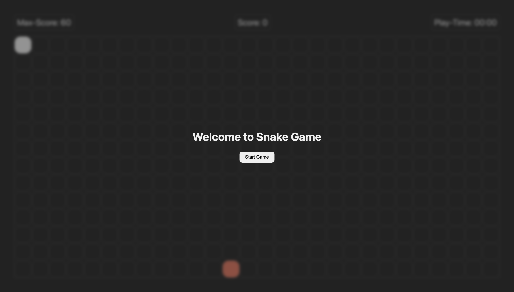

# 🐍 Snake Game(End Term Project)



## � Project Details

**Submission by:** Kartik Gupta  
**Roll No:** 25BCS10035  
**Student Mail Id:** kartik.25bcs10035@sst.scaler.com  
**Submitted to:** Mrinal Bhattacharya

## �📖 Description

A classic Snake Game built with vanilla JavaScript, HTML, and CSS. Control the snake to eat food, grow longer, and achieve the highest score! The game features smooth gameplay, collision detection, score tracking with local storage, and a responsive grid-based design.

## ✨ Features

- **Classic Snake Gameplay**: Control the snake using arrow keys to navigate the board
- **Responsive Grid System**: Dynamic board that adapts to container size
- **Score Tracking**: 
  - Current score display
  - Maximum score tracking using localStorage
  - Score persists across game sessions
- **Play Timer**: Real-time timer showing how long you've been playing
- **Food Generation**: Random food placement on the board
- **Collision Detection**: Game ends when the snake collides with itself
- **Smooth Animations**: CSS transitions and hover effects
- **Game States**: 
  - Welcome screen with start button
  - Active gameplay
  - Game over screen with final score and restart option
- **Modern UI**: Dark theme with clean, minimalist design

## 🎮 How to Play

1. Open `index.htm` in your web browser
2. Click the "Start Game" button to begin
3. Use arrow keys to control the snake:
   - **Arrow Right** → Move right
   - **Arrow Left** → Move left
   - **Arrow Up** → Move up
   - **Arrow Down** → Move down
4. Eat the red food blocks to grow your snake and increase your score
5. Avoid running into yourself
6. Try to beat your maximum score!

## 🎯 Scoring

- Each food item eaten: **+10 points**
- Maximum score is automatically saved to localStorage

## 🛠️ Technologies Used

- **HTML5**: Structure and markup
- **CSS3**: Styling with CSS variables for theming
- **JavaScript (ES6+)**: Game logic and DOM manipulation
- **localStorage API**: Persistent score tracking

## 📁 Project Structure

```
Snake-Game/
│
├── index.html          # Main HTML file with game structure
├── script.js          # Game logic and functionality
├── style.css          # Styling and visual design
├── Image.png          # Project screenshot
└── Readme.md          # Project documentation
```

## 🎨 Key Implementation Details

### Grid System
- Dynamic grid creation based on container dimensions
- Each block is 48x48 pixels
- Grid automatically calculates rows and columns

### Snake Movement
- Snake moves every 200ms
- Direction changes are prevented from reversing (can't go left if moving right)
- Wraps around board edges (goes to opposite side)

### Game Logic
- Snake is represented as an array of coordinates (head to tail)
- Collision detection checks if snake head hits any body segment
- Food respawns at random locations after being eaten
- Score updates in real-time

### CSS Variables
The project uses CSS custom properties for easy theming:
- Background colors
- Text colors
- Spacing and sizing
- Border radius
- Border colors

## 🚀 Setup and Installation

1. Clone or download this repository
2. No build process or dependencies required
3. Simply open `index.html` in any modern web browser
4. Start playing!

## 📱 Browser Compatibility

Works on all modern browsers that support:
- ES6+ JavaScript
- CSS Grid
- CSS Custom Properties
- localStorage API

## 🎯 Future Enhancements

Possible improvements for future versions:
- Mobile touch controls
- Difficulty levels (speed variations)
- Different game modes
- Sound effects
- Leaderboard system
- Pause/resume functionality
- Customizable themes
- Power-ups and special items

## 👨‍💻 Development

This project was created as a Term 2 End Term project, demonstrating:
- DOM manipulation
- Event handling
- Game loop implementation
- State management
- CSS layout techniques
- LocalStorage usage

## 📝 License

This is an educational project. Feel free to use and modify as needed.

## 🤝 Contributing

Feel free to fork this project and add your own enhancements!

---

**Enjoy the game and happy coding! 🎮🐍**
