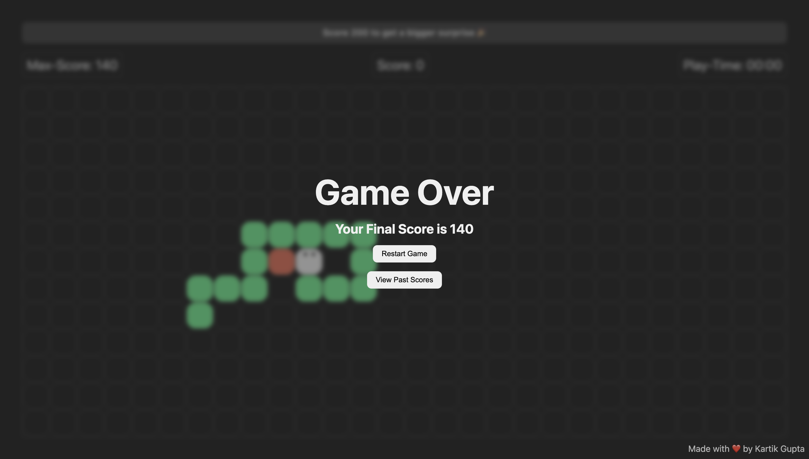

# 🐍 Snake Game(End Term Project)



## 🎥 Video Demonstration

**[Watch the Full Project Demo (8-9 mins)](https://drive.google.com/file/d/19XKlzR_VwgmhmtGdRJuTOeNuOzWyJE9j/view?usp=sharing)** 🎬

## 📋 Project Details

**Submission by:** Kartik Gupta  
**Roll No:** 25BCS10035  
**Student Mail Id:** kartik.25bcs10035@sst.scaler.com  
**Submitted to:** Mrinal Bhattacharya

## 📖 Description

An enhanced Snake Game built with vanilla JavaScript, HTML, and CSS featuring progressive difficulty, visual milestone rewards (including a rainbow snake at 600+ points!), comprehensive score tracking, and responsive design. Challenge yourself to unlock all surprises!

## ✨ Features

- **Progressive Difficulty**: Speed increases every 15 seconds (200ms → 80ms)
- **Visual Rewards**: Snake color changes at 100/200/300 points, rainbow animation at 600+ points
- **Score Tracking**: Current score, max score (localStorage), and last 10 games with timestamps
- **Responsive Grid**: Dynamic 48x48px grid with edge wrapping
- **Smart Controls**: Arrow keys or WASD, direction reversal protection
- **Modern UI**: Dark theme, animated eyes on snake head, motivational messages
- **Auto-save**: Progress saved even on page reload
- **Past Scores**: View history with timestamps, clear all option

## 🎮 How to Play

1. Open `index.html` and click "Start Game"
2. Control with Arrow Keys (↑↓←→) or WASD
3. Eat glowing food for +10 points, avoid self-collision
4. Speed increases every 10 seconds - stay focused!
5. Unlock color upgrades: 100 (green) → 200 (blue) → 300 (purple) → 600 (rainbow)
6. View past scores and track your progress

## 🎯 Scoring

- +10 points per food
- Max score saved in localStorage
- Last 10 games with timestamps
- Color milestones: 100 🟢 | 200 🔵 | 300 🟣 | 600 🌈

## 🛠️ Technologies Used

- **HTML5**: Structure and markup
- **CSS3**: Styling with CSS variables for theming
- **JavaScript (ES6+)**: Game logic and DOM manipulation
- **localStorage API**: Persistent score tracking

## 📁 Project Structure

```
Snake-Game/
│
├── assets/                           # Image assets folder
│   ├── food.png                      # Food item image asset
│   ├── favicon.png                   # Browser tab icon
│   ├── Image.png                     # Project screenshot
│   ├── Demo Vedio Recording.mov      # Project demo video
├── index.html                        # Main HTML file with game structure and modals
├── script.js                         # Game logic, state management, and event handlers (369 lines)
├── style.css                         # Comprehensive styling with CSS variables (346 lines)
└── Readme.md                         # Project documentation
```

## 🎨 Key Implementation

**Grid System:** 48x48px blocks with CSS Grid, rounded corners, dynamic sizing  
**Speed Progression:** 200ms → 80ms in 20ms increments every 10 seconds  
**Snake Logic:** Array of coordinates, collision detection, edge wrapping with modulo  
**Data Persistence:** localStorage for scores, beforeunload auto-save  
**Visual Effects:** CSS variables, rainbow gradient animation, pseudo-elements for eyes

## 🚀 Setup

1. Clone or download this repository
2. Open `index.html` in any modern browser
3. Start playing!

**Requirements:** Modern browser with ES6+, CSS Grid, localStorage support

## 🎯 Future Enhancements

Mobile controls • Sound effects • Pause functionality • Power-ups • Online leaderboard • Multiplayer mode • Custom themes • Achievement system

## 👨‍💻 Development

This project was created as a Term 2 End Term project, demonstrating:

### JavaScript Concepts
- **DOM Manipulation**: Dynamic element creation, classList management, innerHTML updates
- **Event Handling**: Keyboard events (keydown), click events, beforeunload
- **Game Loop**: setInterval with dynamic speed, clearInterval for restarts
- **State Management**: Multiple state flags, game flow control, modal management
- **Data Structures**: Array manipulation for snake (unshift, pop, some, forEach, map)
- **Algorithms**: Collision detection, random positioning with validation, modulo for wrapping
- **Storage**: localStorage for persistence (getItem, setItem, removeItem), JSON parse/stringify
- **Timing**: Multiple concurrent intervals (game loop, timer, speed increase)
- **String Manipulation**: Template literals, split/join for timer display

### CSS Concepts
- **Layout**: CSS Grid (auto-fill, minmax), Flexbox (column, row, center alignment)
- **Positioning**: Fixed footer, absolute pseudo-elements for eyes, relative positioning
- **Custom Properties**: CSS variables for theming, reusability, maintainability
- **Animations**: @keyframes for rainbow effect, transitions for hover states
- **Pseudo-elements**: ::before and ::after for snake eyes based on direction
- **Responsive Design**: Dynamic sizing based on viewport, window resize handling
- **Visual Effects**: backdrop-filter blur, box-shadow, drop-shadow, border-radius

### HTML Structure
- **Semantic HTML**: main, section, footer elements
- **Modal System**: Multiple overlapping screens (start, game over, past scores)
- **Accessibility**: Proper heading hierarchy, button elements
- **Asset Management**: External images in assets folder (food.png, favicon.png)

## 📝 License

This is an educational project. Feel free to use and modify as needed.

## 🤝 Contributing

Feel free to fork this project and add your own enhancements!

---

**Enjoy the game and happy coding! 🎮🐍**